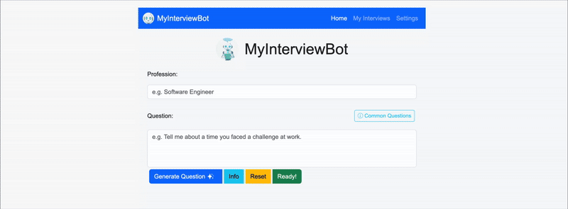
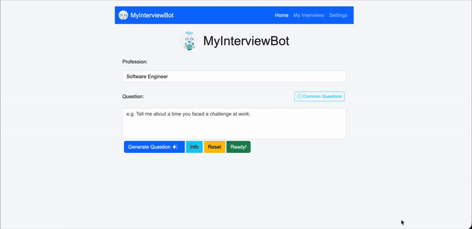
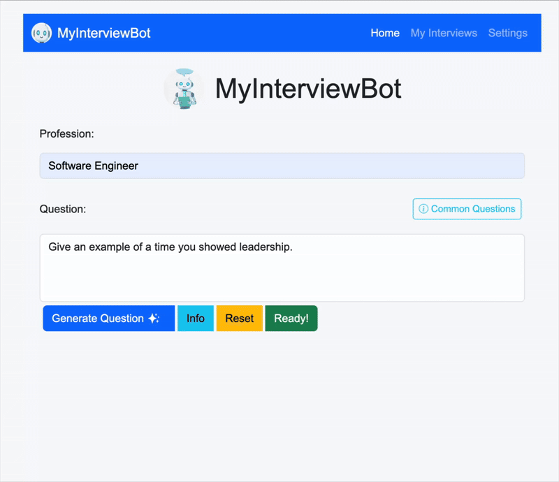
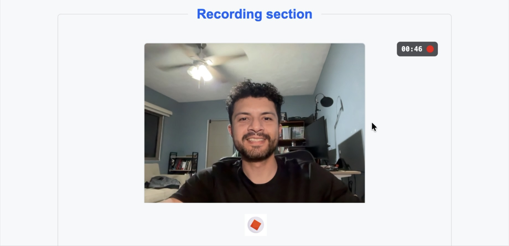
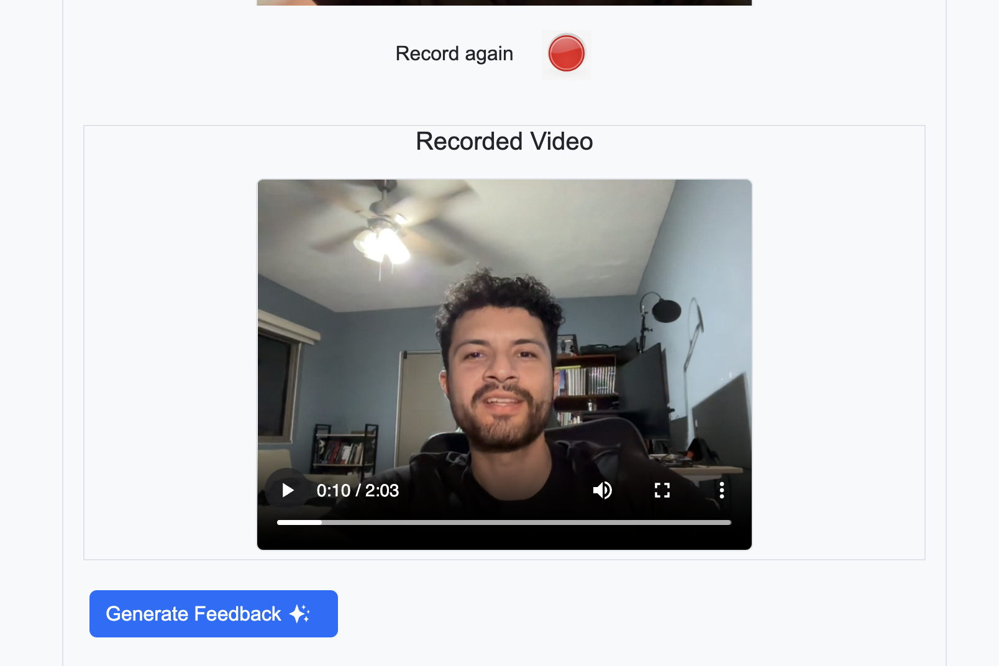
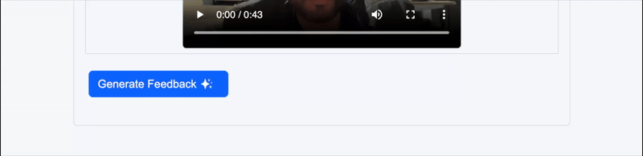
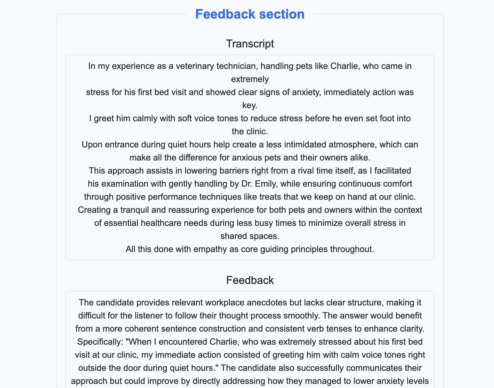
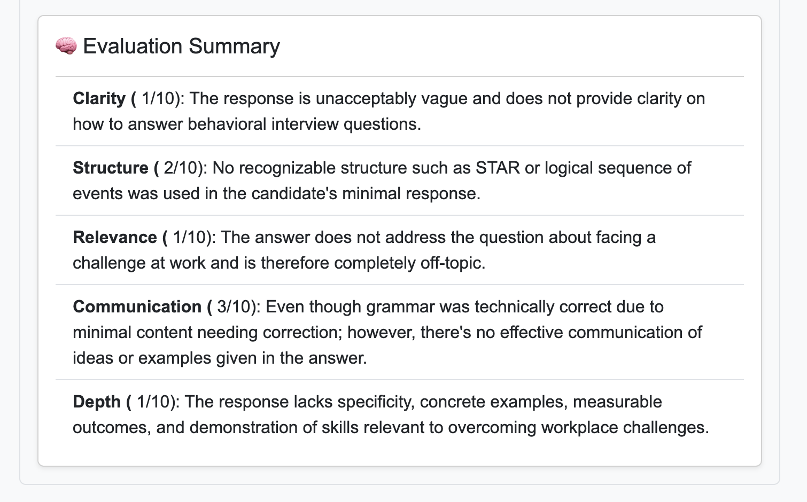

# 🧠 My Interview Bot - Behavioral Interview Practice App

This is a **local AI-powered interview practice tool** that helps you improve your **behavioral interview skills**.
It uses **Ollama** for local LLM inference and **Whisper** for speech-to-text transcription, allowing you to **speak
your answers** and get instant feedback from an AI **hiring manager**.

---

## 🚀 Features

- 🎤 **Voice-based answers** using Whisper for transcription
- 🧑‍💼 **Realistic behavioral interview questions** tailored for *any profession* the user inputs
- 💬 **AI feedback** focused on clarity, structure, and communication style
- 💾 **Local storage of interviews** — all interview data (video files, transcripts, and feedback) are stored locally in
  the `uploads/interviews/` directory.  
  Each interview is organized in its own subfolder, and you can manage (view or delete) them directly from the
  **MyInterviews** page in the app.
- ⚙️ **Customizable model selection**
- 🔒 Runs fully **locally** (no cloud or API key required)

---

## 🧩 Prerequisites

Make sure you have the following installed before running the app:

| Tool               | Description                                                                    | Install Command / Notes                                             | Approx. Space        |
|--------------------|--------------------------------------------------------------------------------|---------------------------------------------------------------------|----------------------|
| **Java 17+**       | Required to run the Spring Boot app                                            | [Download Java](https://adoptium.net/)                              | ~300 MB              |
| **Ollama**         | Local LLM runtime                                                              | [Install Ollama](https://ollama.ai/download)                        | ~1.5 GB              |
| **AI model**       | Check out the available models at [Ollama library](https://ollama.com/library) | Example: `ollama pull phi3`                                         | Depends on the model |
| **Python 3 + pip** | Required for Whisper                                                           | [Install Python](https://www.python.org/downloads/)                 | ~500 MB              |
| **FFmpeg**         | Required by Whisper for audio processing                                       | macOS: `brew install ffmpeg` <br> Ubuntu: `sudo apt install ffmpeg` | ~200 MB              |
| **Whisper**        | Speech-to-text transcription                                                   | `pip install -U openai-whisper`                                     | ~1.5 GB              |

---

## ⚙️ Installation & Setup

1. **Clone this repository:**
   ```bash
   git clone https://github.com/alanquintero/myInterviewBot
   cd myInterviewBot
   ```
2. Configure the AI model in `application.properties` (`llama3.1:8b` is the default model):

```properties
ai-model=llama3.1:8b
```

3. **Run the app with Spring Boot:**
   ```bash
    mvn spring-boot:run
   ```

4. **Open the app:**

5. Visit [http://localhost:8080](http://localhost:8080) in your browser.

---

## 🎙️ Troubleshooting

| Issue                               | Possible Cause                                      | Solution                                                                                   |
|-------------------------------------|-----------------------------------------------------|--------------------------------------------------------------------------------------------|
| 🎧 **No mic input / camera access** | Browser permissions or wrong device selected        | Check browser settings → Allow mic and camera, and ensure the correct devices are selected |
| ❌ **Cannot install Whisper**        | Make sure Python version is compatible with Whisper | Check Whisper official site [openai-whisper](https://pypi.org/project/openai-whisper/)     |
| ❌ **“Model not found” error**       | You haven’t pulled the model                        | Example, run `ollama pull phi3`                                                            |
| 🐍 **`pip` command not found**      | pip not installed                                   | macOS/Linux: `sudo apt install python3-pip` or `brew install python3`                      |
| 🐢 **Slow transcription**           | Whisper base model is large                         | Try smaller Whisper models (like `tiny` or `base`) (Not yet available in the app)          |

---

## ⚙️ Configuration

Developers can configure the AI model in `application.properties`:

```properties
ai-model=llama3.1:8b
```

You can replace `llama3.1:8b` with another Ollama model, such as `mistral`, `phi3`, or any other model available
locally.

Or, when running the app, you can override any property like this:

```bash
mvn spring-boot:run -Dspring-boot.run.arguments="--ai.model=phi3"
```

Example of running a JAR overring properties:

```bash
java -jar myinterviewbot.jar \ --ai.provider=ollama \ --ai.model=phi3:latest
```

---

## 🧩 Choosing the Right Ollama Model

Picking the right model depends on what you care about most — **speed**, **accuracy**, or **resource usage**.
Here’s a quick guide:

| 💻 Laptop Type               | 🧠 Recommended Model  | 📦 Approx. Size | ✅ Benefits                                                                                                             | ⚠️ Limitations                                                             |
|------------------------------|-----------------------|-----------------|------------------------------------------------------------------------------------------------------------------------|----------------------------------------------------------------------------|
| **8–12 GB RAM**              | **Phi-3 Mini (3.8B)** | ~2 GB           | 🟢 Extremely fast<br>🟢 Small download<br>🟢 Great for quick Q&A and light tasks                                       | 🔴 Limited reasoning depth<br>🔴 Not ideal for long conversations          |
| **8–12 GB RAM**              | **Mistral 7B**        | ~4 GB           | 🟢 Smart and efficient<br>🟢 Handles follow-ups better than Phi-3<br>🟢 Good general-purpose model                     | 🔴 Slightly robotic tone<br>🔴 Less consistent on complex logic            |
| **16–18 GB RAM**             | **Llama 3.1 (8B)**    | ~5 GB           | 🟢 Excellent reasoning<br>🟢 Natural, human-like answers<br>🟢 Great for behavioral interview simulation               | 🔴 Slightly slower startup<br>🔴 Requires quantized version for best speed |
| **16–18 GB RAM**             | **Gemma 2 (9B)**      | ~6 GB           | 🟢 Balanced quality and speed<br>🟢 Friendly conversational tone<br>🟢 Efficient on Apple Silicon                      | 🔴 Can occasionally repeat or overexplain                                  |
| **24+ GB RAM / M3 Pro–Max**  | **Llama 3.1 (13B)**   | ~8–9 GB         | 🟢 High-quality, detailed reasoning<br>🟢 Handles multi-turn interviews beautifully<br>🟢 Very consistent and coherent | 🔴 Slower on smaller laptops<br>🔴 Heavy model                             |
| **Server / Multi-GPU Setup** | **Llama 3.1 (70B)**   | ~40–45 GB       | 🟢 Near GPT-4 quality<br>🟢 Exceptional reasoning and memory<br>🟢 Ideal for research or production AI agents          | 🔴 Requires 64 GB+ RAM or GPU cluster<br>🔴 Very slow download / load      |

Check available models at [Ollama library](https://ollama.com/library).

Example of getting a model:

```bash
ollama pull llama3.1:8b
```

Show all the models that are currently installed on your machine:

```bash
ollama list
```

---

## 🚀 How It Works

1. Enter a **Profession** and click **Generate Question** to receive a tailored interview prompt.
   

   1.a Enter your own question or choose one from the most common interview questions.
   

2. Click **Ready** when you are ready to answer the question.
   

3. Record your answer directly in the app.
   

4. Review your video after recording.
   

5. Click **Generate Feedback** to analyze your response.
   

6. Instantly get a **Transcript** and AI-powered **Feedback** and **Evaluation** on your performance.
   

7. Visit the **My Interviews** page anytime to view all your past practice sessions.
   

---

## 🧭 Roadmap / Future Development

### 🚀 Core Features

- [x] 🧭 Conversation history — track progress over time
- [x] 💻 Custom Questions — enter the question you want to practice
- [x] 🎯 Scoring system — rate clarity, confidence, relevance, etc.
- [ ] 📄 Resume Interview Mode — tailor questions based on uploaded resume
- [ ] 💻 Technical Interview Mode — technical questions
- [ ] 🤝 Mock Interview Mode – A session to practice common questions asked in job interviews
- [ ] 🔁 Continuous Interview Mode - Seamlessly move from feedback to the next question to simulate a complete interview
  session
- [ ] 📊 Progress Analytics — graphs for improvement over time
- [ ] 🤖 Add more AI providers (e.g., OpenAI GPT-4, Claude, Gemini)
- [ ] 🗣️ Text-to-Speech for AI questions and feedback
- [ ] 🤖 Add support for smaller Whisper models (e.g., tiny, base)
- [ ] 🎨 Improved UI/UX — modern dashboard, light/dark mode, analytics
- [ ] ⚙️ Settings fully customizable from the app — change AI provider, change AI model, enable or disable
  text-to-speech, change recording time, only audio interview, etc.

### 🧪 Experimental Ideas

* 🧠 **Feedback memory** — personalized tips based on past sessions
* 💬 **AI interviewer personalities** (strict, friendly, technical)
* 🗂️ **Integration with Google Drive or Notion** for saving feedback

---

## 🧰 Tech Stack

* **Backend:** Java 17, Spring Boot
* **Frontend:** HTML, JavaScript, CSS, Bootstrap
* **AI:** Ollama, Whisper (speech-to-text), FFmpeg (audio)
* **Build Tool:** Maven

---

## 🧑‍💻 Contributing

Contributions are welcome!
If you’d like to help add features, fix bugs, or improve documentation:

1. Fork the repo
2. Create a feature branch
3. Submit a pull request

---

## 📜 License

MIT License — free to use, modify, and distribute.
