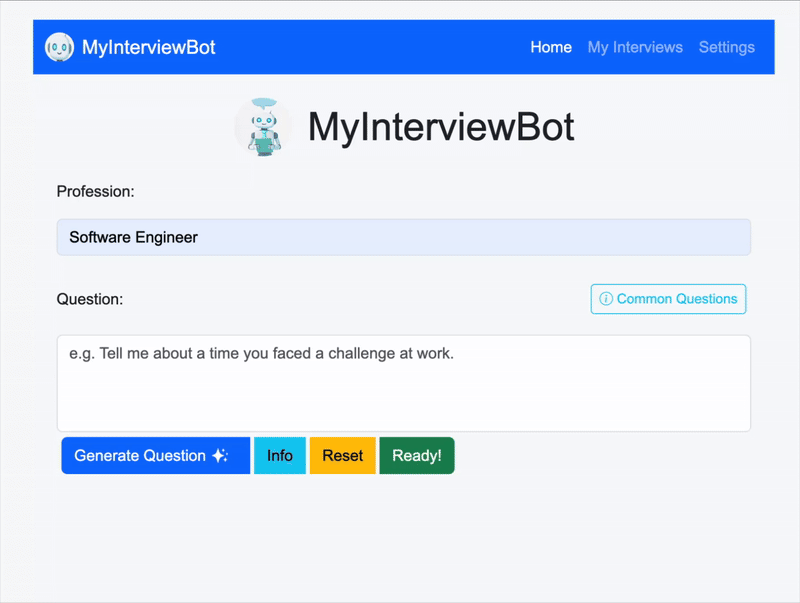

# 🧠 My Interview Bot - Behavioral Interview Practice App

This is a **local AI-powered interview practice tool** that helps you improve your **behavioral interview skills**.
It uses **Ollama** for local LLM inference and **Whisper** for speech-to-text transcription, allowing you to **speak
your answers** and get instant feedback from an AI **hiring manager**.

---

## 🚀 Features

- 🎤 **Voice-based answers** using Whisper for transcription
- 🧑‍💼 **Realistic behavioral interview questions** tailored for *any profession* the user inputs
- 💬 **AI feedback** focused on clarity, structure, and communication style
- 💾 **Local storage of interviews** — all interview data (video files, transcripts, and feedback) are stored locally in
  the `uploads/interviews/` directory.  
  Each interview is organized in its own subfolder, and you can manage (view or delete) them directly from the
  **MyInterviews** page in the app.
- ⚙️ **Customizable model selection** (default: `phi3`)
- 🔒 Runs fully **locally** (no cloud or API key required)

---

## 🧩 Prerequisites

Make sure you have the following installed before running the app:

| Tool                        | Description                              | Install Command / Notes                                             | Approx. Space |
|-----------------------------|------------------------------------------|---------------------------------------------------------------------|---------------|
| **Java 17+**                | Required to run the Spring Boot app      | [Download Java](https://adoptium.net/)                              | ~300 MB       |
| **Ollama**                  | Local LLM runtime                        | [Install Ollama](https://ollama.ai/download)                        | ~1.5 GB       |
| **Phi-3 model** *(default)* | Fast, efficient local model              | `ollama pull phi3`                                                  | ~2 GB         |
| **Python 3 + pip**          | Required for Whisper                     | [Install Python](https://www.python.org/downloads/)                 | ~500 MB       |
| **FFmpeg**                  | Required by Whisper for audio processing | macOS: `brew install ffmpeg` <br> Ubuntu: `sudo apt install ffmpeg` | ~200 MB       |
| **Whisper**                 | Speech-to-text transcription             | `pip install -U openai-whisper`                                     | ~1.5 GB       |

---

## ⚙️ Installation & Setup

1. **Clone this repository:**

   ```bash
   git clone https://github.com/alanquintero/myInterviewBot
   cd myInterviewBot
   ```

2. **Run the app with Spring Boot:**

   ```bash
    mvn spring-boot:run
   ```

3. **Open the app:**
   Visit [http://localhost:8080](http://localhost:8080) in your browser.

---

## 🎙️ Troubleshooting

| Issue                               | Possible Cause                                      | Solution                                                                                   |
|-------------------------------------|-----------------------------------------------------|--------------------------------------------------------------------------------------------|
| 🎧 **No mic input / camera access** | Browser permissions or wrong device selected        | Check browser settings → Allow mic and camera, and ensure the correct devices are selected |
| ❌ **Cannot install Whisper**        | Make sure Python version is compatible with Whisper | Check Whisper official site [openai-whisper](https://pypi.org/project/openai-whisper/)     |
| ❌ **“Model not found” error**       | You haven’t pulled the model                        | Run `ollama pull phi3`                                                                     |
| 🐍 **`pip` command not found**      | pip not installed                                   | macOS/Linux: `sudo apt install python3-pip` or `brew install python3`                      |
| 🐢 **Slow transcription**           | Whisper base model is large                         | Try smaller Whisper models (like `tiny` or `base`)                                         |

---

## ⚙️ Configuration

Developers can configure the AI model in `application.properties`:

```properties
interviewbot.ai-model=phi3
```

You can replace `phi3` with another Ollama model, such as `mistral`, `llama3`, or any other model available locally.


---

## 🚀 How It Works

1. Enter a **Profession** and click **Generate Question** to receive a tailored interview prompt.
   

   1.a Enter your own question or choose one from the most common interview questions.
   

2. Click **Ready** when you are ready to answer the question.
   

3. Record your answer directly in the app.
   

4. Review your video after recording.
   

5. Click **Generate Feedback** to analyze your response.
   

6. Instantly get a **Transcript** and AI-powered **Feedback** and **Evaluation** on your performance.
   

7. Visit the **My Interviews** page anytime to view all your past practice sessions.
   

---

## 🧭 Roadmap / Future Development

### 🚀 Core Features

- [x] 🧭 Conversation history — track progress over time
- [x] 💻 Custom Questions — enter the question you want to practice
- [x] 🎯 Scoring system — rate clarity, confidence, and relevance
- [ ] 📄 Resume Interview Mode — tailor questions based on uploaded resume
- [ ] 💻 Technical Interview Mode — technical questions
- [ ] 📊 Progress Analytics — visualize your evaluation scores over time
- [ ] 🤖 Add more AI models (e.g., OpenAI GPT-4, Claude, Gemini)
- [ ] 🗣️ Text-to-Speech for AI questions and feedback
- [ ] 🧠 Feedback memory — personalized tips based on past sessions
- [ ] 🎨 Improved UI/UX — modern dashboard, light/dark mode, analytics

### 🧪 Experimental Ideas

* 💬 **AI interviewer personalities** (strict, friendly, technical)
* 📊 **Performance insights** — graphs for improvement over time
* 🗂️ **Integration with Google Drive or Notion** for saving feedback

---

## 🧰 Tech Stack

* **Backend:** Java 17, Spring Boot
* **Frontend:** HTML, JavaScript, CSS, Bootstrap
* **AI:** Ollama (Phi3), Whisper (speech-to-text), FFmpeg (audio)
* **Build Tool:** Maven

---

## 🧑‍💻 Contributing

Contributions are welcome!
If you’d like to help add features, fix bugs, or improve documentation:

1. Fork the repo
2. Create a feature branch
3. Submit a pull request

---

## 📜 License

MIT License — free to use, modify, and distribute.
